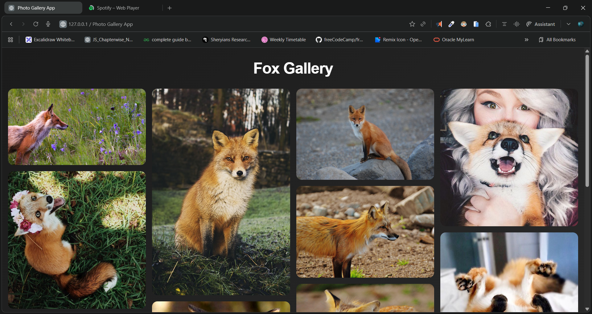
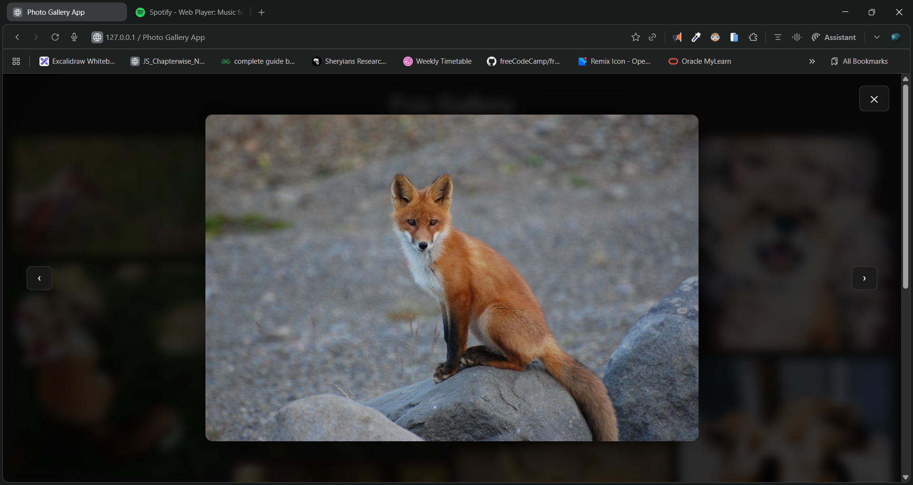

# 📸 Fox Gallery – Random Fox Photo Masonry App

A beautiful, responsive **masonry-style photo gallery** that automatically fetches cute random fox images from the public API **randomfox.ca**.
Features include smooth hover effects, keyboard-friendly navigation, a fullscreen preview modal, and dynamic "Load More" functionality.

---

## 🚀 Live Demo

🔗 **Live Website:** [https://dileep-kumawat.github.io/Photo-Gallery-using-html-css-and-js/](https://dileep-kumawat.github.io/Photo-Gallery-using-html-css-and-js/)

---

## 🖼️ Preview Screenshots

### 🧩 Masonry Grid Layout



### 🔍 Fullscreen Image Modal



---

## 🎥 Demo Video

▶️ **Watch the Walkthrough:** [click to watch](https://youtu.be/Sjeha1mro2A)

---

## ✨ Features

* 🦊 Auto-loads fox images from **randomfox.ca**
* 🧱 Smooth responsive **masonry grid**
* 🖱️ Fullscreen modal with:

  * Next / Previous buttons
  * Keyboard controls (ESC, ←, →)
* ➕ “Load More” button to fetch more images
* 🎨 Modern frosted-glass UI
* 💨 Smooth animations and transitions

---

## 📁 Project Structure

```
📂 Fox-Gallery
│── index.html   # Main UI
│── script.js    # Fetching + modal logic
```

---

## 💡 How It Works

### Fetching Images

The app calls the API:

```
https://randomfox.ca/floof/
```

Each response provides a new fox image URL, which is pushed into an array and rendered into the masonry grid.


### Modal Preview

Clicking any image opens it fullscreen, with navigation buttons and keyboard support.


---

## 🛠️ Technologies Used

* HTML5
* CSS3 (responsive layout + effects)
* Vanilla JavaScript (fetch API, DOM operations)
* RandomFox API

---

## 📦 How to Run Locally

1. Download or clone the repository
2. Open `index.html` in any browser
3. Enjoy endless foxes 🦊✨

---

## 🤝 Contributing

Feel free to fork, modify, or open issues.
PRs are always welcome!

---

## 🧑‍💻 Author

Built by **Dileep**
🔥 Passionate Frontend & Full-Stack Developer
- 📧 [dileepkumawat525@gmail.com](mailto:dileepkumawat525@gmail.com)
- 🔗 [LinkedIn](https://www.linkedin.com/in/dileep-kumawat/)

---

## ❤️ Credits

* Images provided by **RandomFox API**
* Built by *Dileep kumawat* 🚀
